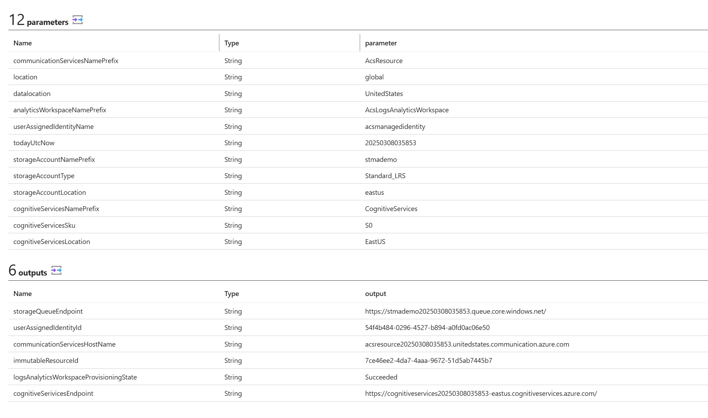

# Managed Communication Services

Note: This sample is for Managed Application in Service Catalog. For Marketplace, see the instructions at:
[**Marketplace Managed Application**](https://docs.microsoft.com/en-us/azure/managed-applications/publish-marketplace-app)

## Package the files

### Prerequisite: Run the `RegisterResourceProviders.ps1` script to register the resource providers before running the Managed Applications script

Note: The `Publish-ManagedApplication.ps1` PowerShell script packages the application and publishes to Azure. 

Add the following files to a package file name `managedcommunicationservices.zip`. The files must be at the root folder of the zip file.
1. creatUiDefinition.json
1. mainTemplate.json
1. AzureTemplates folder

Upload the managedcommunicationservices.zip to an Azure Storage account so you can use it when you deploy the managed application's definition. The storage account name must be globally unique across Azure and the length must be 3-24 characters with only lowercase letters and numbers. In the command, replace the placeholder <pkgstorageaccountname> including the anble brackets(<>), with your unique storage account name.

````powershell
Connect-AzAccount
````

The command opens your default browser and prompts you to sign in to Azure. For more information, go to [Sign in with Azure PowerShell](https://learn.microsoft.com/en-us/powershell/azure/authenticate-azureps).

````powershell
New-AzResourceGroup -Name packageStorageGroup -Location westus

$pkgstorageparms = @{
  ResourceGroupName = "packageStorageGroup"
  Name = "<pkgstorageaccountname>"
  Location = "westus"
  SkuName = "Standard_LRS"
  Kind = "StorageV2"
  MinimumTlsVersion = "TLS1_2"
  AllowBlobPublicAccess = $true
  AllowSharedKeyAccess = $false
}

$pkgstorageaccount = New-AzStorageAccount @pkgstorageparms
````

After you create the storage account, add the role assignment Storage Blob Data Contributor to the storage account scope. Assign access to your Microsoft Entra user account. Depending on your access level in Azure, you might need other permissions assigned by your administrator. For more information, see [Assign an Azure role for access to blob data](https://learn.microsoft.com/en-us/azure/storage/blobs/assign-azure-role-data-access) and [Assign Azure roles using the Azure portal](https://learn.microsoft.com/en-us/azure/role-based-access-control/role-assignments-portal).

After you add the role to the storage account, it takes a few minutes to become active in Azure. You can then create the context needed to create the container and upload the file.

````powershell
$pkgstoragecontext = New-AzStorageContext -StorageAccountName $pkgstorageaccount.StorageAccountName -UseConnectedAccount

New-AzStorageContainer -Name appcontainer -Context $pkgstoragecontext -Permission blob

$blobparms = @{
  File = "app.zip"
  Container = "appcontainer"
  Blob = "app.zip"
  Context = $pkgstoragecontext
}

Set-AzStorageBlobContent @blobparms
````

## Get group ID or Service Principal or userId and role definition ID
The next step is to select a user, security group, or application for managing the resources for the customer. This identity has permissions on the managed resource group according to the assigned role. The role can be any Azure built-in role like Owner or Contributor.

This example uses a security group, and your Microsoft Entra account should be a member of the group. To get the group's object ID, replace the placeholder <managedAppAccessGroup> including the angle brackets (<>), with your group's name. You use this variable's value when you deploy the managed application definition.

### Using Powershell

For getting SecurityGroup ID
````powershell
$groupId=(Get-AzADGroup -DisplayName <managedAppAccessGroup>).Id
````

For getting ServicePrincipal
````powershell
$principalid=(Get-AzADServicePrincipal -DisplayName <servicePrincipalName>).Id
````
For getting UserId of 
````powershell
$userId = (Get-AzADUser -UserPrincipalName <username>).Id
````

For logged in user

````powershell
$userId = (Get-AzADUser -UserPrincipalName (Get-AzContext).Account).Id
````


Next, get the role definition ID of the Azure built-in role you want to grant access to the user, group, or application. You use this variable's value when you deploy the managed application definition.

````powershell
$roleid=(Get-AzRoleDefinition -Name Owner).Id
````

### Using AzureCLI

To get the group's object ID, replace the placeholder <managedAppAccessGroup> including the angle brackets (<>), with your group's name.

````azureCLI
principalid=$(az ad group show --group <managedAppAccessGroup> --query id --output tsv)
````

Next, get the role definition ID of the Azure built-in role you want to grant access to the user, group, or application. You use this variable's value when you deploy the managed application definition.

````azureCLI
roleid=$(az role definition list --name Owner --query [].name --output tsv)
````

## Deploy this sample to your Service Catalog

### Deploy using Azure Portal

Clicking on the button below, will create the Managed Application definition to a Resource Group in your Azure subscription.

[](https://portal.azure.com/#create/Microsoft.Template/uri/https%3A%2F%2Fskype.visualstudio.com%2FSCC%2F_git%2Fic3_acs_events?path=prototypes%2Fmanaged%2Fmanaged-applications%2Fmanaged-communication-services%2F%2Fazuredeploy.json)

Follow the instructions at [Deploy using Powershell](https://learn.microsoft.com/en-us/azure/azure-resource-manager/managed-applications/publish-service-catalog-app?tabs=azure-powershell) for packaging the files. 
Note: The managedcommunicationservices.zip should contain the nestedtemplates folder, createUiDefinition.json and maintemplate.json files.

### Deploy using PowerShell

Run the script under Publish-ManagedApplication.ps1 to publish the Managed Application definition. or follow these instructions below.

Create a resource group for your managed application definition.

````powershell
New-AzResourceGroup -Name appDefinitionGroup -Location westus
````

The blob command creates a variable to store the URL for the package .zip file. That variable is used in the command that creates the managed application definition.

````powershell
$blob = Get-AzStorageBlob -Container appcontainer -Blob managedcommunicationservices.zip -Context $pkgstoragecontext

$rgname = "<yourRgName>"
$location = "<rgLocation>"

$publishparms = @{
  Name = "sampleCommunicationServicesManagedApp"
  Location = $location
  ResourceGroupName = $rgname
  LockLevel = "ReadOnly"
  DisplayName = "Sample managed application for Azure Communication Services"
  Description = "Sample managed application that deploys resources for Azure Communication services"
  Authorization = "${principalid}:$roleid"
  PackageFileUri = $blob.ICloudBlob.StorageUri.PrimaryUri.AbsoluteUri
}

New-AzureRmManagedApplicationDefinition $publishparams
````

### Deploy using AzureCLI

````azureCLI
az group create --name appDefinitionGroup --location westus
````

Modify the snippet below to deploy Managed Application definition to a Resource Group in your Azure subscription

````azureCLI

blob=$(az storage blob url \
  --account-name $pkgstgacct \
  --container-name appcontainer \
  --auth-mode login \
  --name managedcommunicationservices.zip --output tsv)

az managedapp definition create \
  --name "sampleCommunicationServicesManagedApp" \
  --location <rgLocation> \
  --resource-group <yourRgName> \
  --lock-level ReadOnly \
  --display-name "Sample managed application for Azure Communication Services" \
  --description "Sample managed application that deploys resources for Azure Communication services" \
  --authorizations "${principalid}:$roleid" \
  --package-file-uri "$blob"
````

